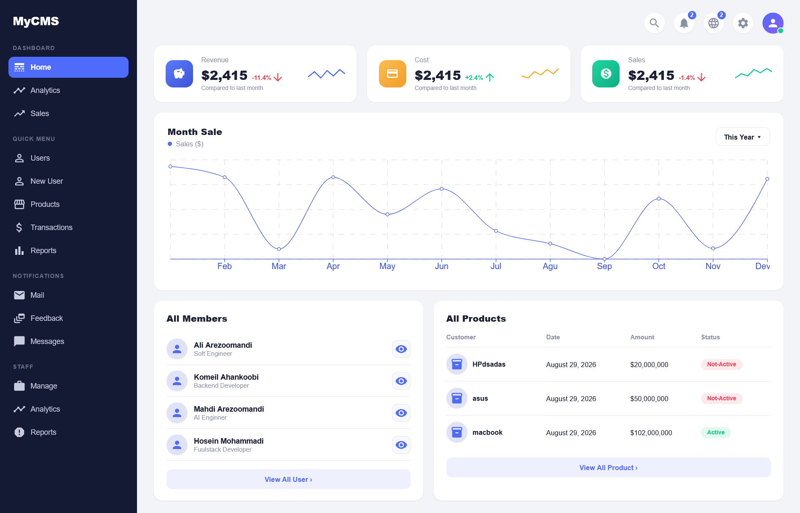
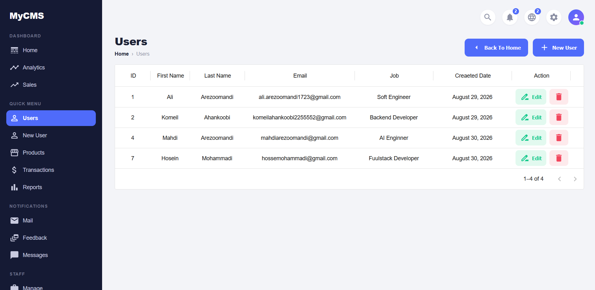
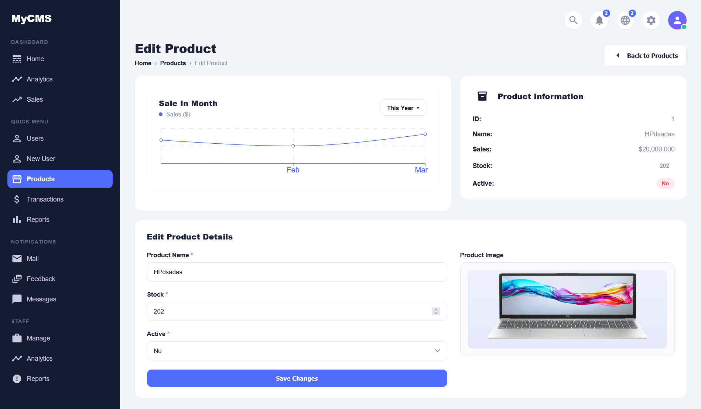
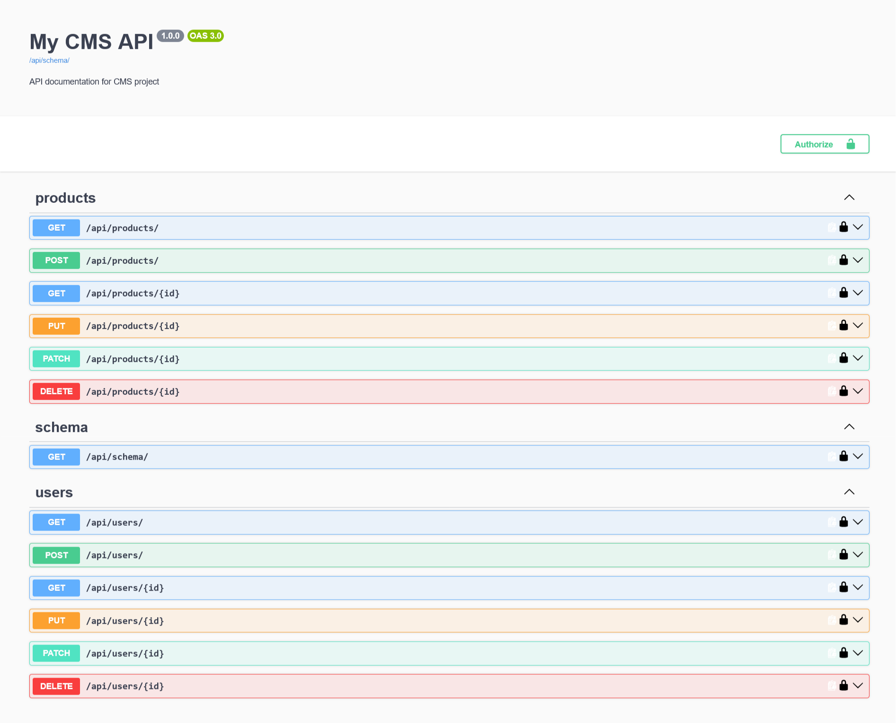

# MyCMS — Simple CMS Dashboard


A full-stack CMS dashboard built with **React** (frontend) and **Django REST Framework** (backend). It provides a simple, clean admin panel for managing users and products, with full CRUD operations, a REST API, and a live dashboard with charts and stats.

This is a personal learning project built to practice combining **React** with **Django REST Framework**.



## Features

-  **Dashboard** — revenue, cost, and sales overview with a monthly sales chart
-  **User management** — list, create, edit, and delete users
-  **Product management** — list, create, edit, and delete products, including image upload and stock/status tracking
-  **REST API** — built with Django REST Framework, fully documented with Swagger/OpenAPI
-  **Modern UI** — built with React and MUI (Material UI) components

## Screenshots

### Users



### Edit Product



### API Documentation



## Tech Stack

**Frontend**
- React
- React Router
- Recharts
- MUI (Material UI) — icons and DataGrid
- CSS

**Backend**
- Django
- Django REST Framework
- SQLite (default; swappable with any Django-supported DB)

## Project Structure

```
cms-project/
├── Backend/          # Django REST Framework API
│   ├── core/         # Project settings, URLs
│   ├── products/     # Products app (models, serializers, views)
│   ├── users/         # Users app (models, serializers, views)
│   └── media/        # Uploaded product images
└── Frontend/
    └── cms-app/      # React application
        └── src/
            ├── components/
            └── pages/
```

## Getting Started

### Prerequisites

- Python 3.10+
- Node.js 16+
- npm or yarn

### Backend Setup

```bash
cd Backend
python -m venv venv
venv\Scripts\activate      # Windows
# source venv/bin/activate # macOS/Linux

pip install -r requirements.txt

python manage.py migrate
python manage.py runserver
```

The API will be available at `http://localhost:8000/api/`.
API documentation (Swagger UI) is available at `http://localhost:8000/api/schema/`.

### Frontend Setup

```bash
cd Frontend/cms-app
npm install
npm start
```

The app will be available at `http://localhost:3000/`.

## API Endpoints

| Method | Endpoint            | Description         |
|--------|----------------------|----------------------|
| GET    | `/api/products/`     | List all products    |
| POST   | `/api/products/`     | Create a product     |
| GET    | `/api/products/{id}` | Retrieve a product   |
| PUT    | `/api/products/{id}` | Replace a product    |
| PATCH  | `/api/products/{id}` | Update a product     |
| DELETE | `/api/products/{id}` | Delete a product     |
| GET    | `/api/users/`        | List all users       |
| POST   | `/api/users/`         | Create a user        |
| GET    | `/api/users/{id}`     | Retrieve a user       |
| PUT    | `/api/users/{id}`     | Replace a user        |
| PATCH  | `/api/users/{id}`     | Update a user         |
| DELETE | `/api/users/{id}`     | Delete a user         |

## Author

**Ali Arezoomandi**
[GitHub](https://github.com/Ali-Arezoomandi)

## License

This project is open source and available for learning purposes.